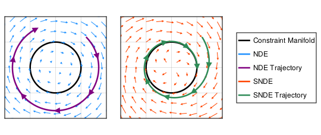

# Stabilized Neural Differential Equations for Learning Dynamics with Explicit Constraints (NeurIPS '23)

<p align="center">  </p>

This repository contains the code and experiments for the NeurIPS 2023 paper *Stabilized Neural Differential Equations for Learning Dynamics with Explicit Constraints* by Alistair White, Niki Kilbertus, Maximilian Gelbrecht, and Niklas Boers.

## Installation
With Julia installed, instantiate the environment by opening the Julia [Pkg](https://pkgdocs.julialang.org/v1/) REPL and doing:

```
(@v1.9) pkg> activate StabilizedNDEs
(StabilizedNDEs) pkg> instantiate
```

## Running Experiments
To run experiments from the command line, do:
```
julia --project=. ./main.jl --experiment two_body_problem \
    --rng-seed 1 --precision Float64 --gamma 8 --augment-dim 0 \
    --layers 2 --width 128 --activation relu  \
    --T 10 --dt 0.1 --steps 3 --n-train 30 --n-valid 10 \
    --optimiser-rule AdamW --optimiser-hyperparams "gamma=1e-6" \
    --epochs 1000 --schedule-file "schedule.toml" \
    --sensealg BacksolveAdjoint --vjp ZygoteVJP \
    --manual-gc --results-file "results.csv"
```

For full details of the command line arguments, do `julia --project=. ./main.jl --help`, or else simply look at the file [command_line.jl](src/command_line.jl).

## Citing Our Work
If you find our work useful, please cite it!
```bibtex
@inproceedings{white2023stabilized,
  title     = {Stabilized Neural Differential Equations for Learning Dynamics with Explicit Constraints},
  author    = {White, Alistair and Kilbertus, Niki and Gelbrecht, Maximilian and Boers, Niklas},
  booktitle = {Advances in Neural Information Processing Systems},
  year      = {2023 (in press)},
}
```
